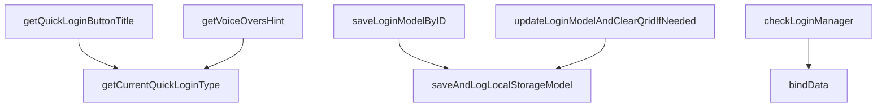

# MMBNewLoginViewModel.swift 完整程式碼分析報告

## 檔案資訊
- 檔案名稱: MMBNewLoginViewModel.swift
- 分析區塊數: 6
- 分析時間: 1757922896.8710024

## 區塊 1 分析結果

```markdown
# 檔案區塊分析

## 基本資訊
- 檔名: MMBNewLoginViewModel.swift
- 語言: swift
- 區塊: 1/6
- 行數: 198

## 函式一覽
- MMBNewLoginViewModel.init(serviceMHMOT: MHMOTLoginProtocol = MHMOT()) [93-104]
  - 參數:
    - serviceMHMOT: MHMOTLoginProtocol optional MHMOT()
  - 回傳: MMBNewLoginViewModel (initializer)
  - 例外: none
  - 副作用: 
    - 設定 `self.manager`
    - 呼叫 `super.init()`
    - 指派 `self.serviceMHMOT`
    - 呼叫 `setupInitValue()` (external/unknown)
    - 呼叫 `bindData()` (external/unknown)

- MMBNewLoginViewModel.transForm() -> Output [191-198]
  - 參數: none
  - 回傳: Output
  - 例外: none
  - 副作用: 
    - 讀取 `apiStateSubject`, `navigationStateSubject`, `loadingViewSubject`
    - 呼叫 `eraseToAnyPublisher()` 於上述 Subject (external/unknown)

## 外部相依
- imports:
  - Foundation — stdlib
  - Combine — stdlib

## 函式關係（區塊內可觀察）
- MMBNewLoginViewModel.init → setupInitValue (external/unknown)
- MMBNewLoginViewModel.init → bindData (external/unknown)
- MMBNewLoginViewModel.transForm → apiStateSubject.eraseToAnyPublisher (external/unknown)
- MMBNewLoginViewModel.transForm → navigationStateSubject.eraseToAnyPublisher (external/unknown)
- MMBNewLoginViewModel.transForm → loadingViewSubject.eraseToAnyPublisher (external/unknown)

## 摘要
- 目的: 定義登入畫面的 ViewModel，管理 API 狀態、導頁狀態與 Loading 狀態的 Combine Publisher，並提供初始化與輸出轉換的介面。
- 範圍/邊界: 只負責資料綁定、狀態發布與錯誤代碼的列舉，實際的 API 呼叫與資料處理邏輯在 `setupInitValue`、`bindData` 等外部方法中實作。
- 備註（若有重要不確定性）: 目前僅觀察到 `setupInitValue`、`bindData` 以及 `eraseToAnyPublisher` 的呼叫，實作細節不在本區塊內，屬於外部/未知。
```

---

## 區塊 2 分析結果

```markdown
# 檔案區塊分析

## 基本資訊
- 檔名: MMBNewLoginViewModel.swift
- 語言: swift
- 區塊: 2/6
- 行數: 199

## 函式一覽
- MMBNewLoginViewModel.saveAccountInfo() [201-205]
  - 參數:
    - 無
  - 回傳: Void
  - 例外: none
  - 副作用: 修改 `Account.shared()` 的 `uid`、`userId`、`pwd`（全域單例）

- MMBNewLoginViewModel.encryptPasswordAndSave(completion: @escaping () -> Void) [207-226]
  - 參數:
    - completion: () -> Void required
  - 回傳: Void
  - 例外: none
  - 副作用: 讀取 `inputContent`，設定 `loginModel` 的 `customerID`、`account`、`pwd`，呼叫 RSA 加密（可能涉及 I/O），最後呼叫 `completion`

- MMBNewLoginViewModel.getCurrentQuickLoginType() -> MMBLoginMethodType? [228-242]
  - 參數:
    - 無
  - 回傳: MMBLoginMethodType? (optional)
  - 例外: none
  - 副作用: 讀取 `MMBLocalStorageModel.sharedInstance().localStorageLoginModel.preferredLoginType` 與 `UIDevice.isFaceIDSupported()`（唯讀）

- MMBNewLoginViewModel.getQuickLoginButtonTitle() -> String [244-260]
  - 參數:
    - 無
  - 回傳: String
  - 例外: none
  - 副作用: 讀取 `getCurrentQuickLoginType()`，回傳對應的本地化字串

- MMBNewLoginViewModel.getVoiceOversHint() -> String [262-279]
  - 參數:
    - 無
  - 回傳: String
  - 例外: none
  - 副作用: 讀取 `getCurrentQuickLoginType()`，回傳對應的語音提示文字

- MMBNewLoginViewModel.saveLoginModelByID(statusModel: MMBBankStatusModel) [281-290]
  - 參數:
    - statusModel: MMBBankStatusModel required
  - 回傳: Void
  - 例外: none
  - 副作用: 修改 `localStorageLoginModel.preferredLoginType`、發送 `.hiddenQuickLoginButton` 事件、呼叫 `saveAndLogLocalStorageModel`（寫入本地儲存與日誌）

- MMBNewLoginViewModel.isInputValid() -> Bool [292-350]
  - 參數:
    - 無
  - 回傳: Bool
  - 例外: none
  - 副作用: 更新 `inputContent` 各欄位的 `state`（UI 狀態）

- MMBNewLoginViewModel.loginKeyCheck(success: (() -> Void)?) [352-366]
  - 參數:
    - success: (() -> Void)? optional
  - 回傳: Void
  - 例外: none
  - 副作用: 若 RSA 金鑰未就緒，導向錯誤頁面、記錄訊息；若就緒則呼叫 `success`

- MMBNewLoginViewModel.updateLoginModelAndClearQridIfNeeded(clearQrid: Bool) [368-383]
  - 參數:
    - clearQrid: Bool required
  - 回傳: Void
  - 例外: none
  - 副作用: 若 `clearQrid` 為 true，呼叫 `FidoRpImpl.sharedInstance().cleanAllLocalFidoRegData()`；修改 `localStorageLoginModel` 的 `preferredLoginType`、`qrid`，並呼叫 `saveAndLogLocalStorageModel`

- MMBNewLoginViewModel.checkLoginManager(loginMethodType: MMBLoginMethodType) [385-392]
  - 參數:
    - loginMethodType: MMBLoginMethodType required
  - 回傳: Void
  - 例外: none
  - 副作用: 若 `manager.loginMethodType` 不同，重新建立 `MMBLoginManager` 並呼叫 `bindData()`

- MMBNewLoginViewModel.getLoginMethodAAString() -> String [394-398]
  - 參數:
    - 無
  - 回傳: String
  - 例外: none
  - 副作用: 讀取 `manager.loginMethodType.loginMethodAAString`（唯讀）

## 外部相依
- imports:
  - none

## 函式關係（區塊內可觀察）
- MMBNewLoginViewModel.getQuickLoginButtonTitle → MMBNewLoginViewModel.getCurrentQuickLoginType
- MMBNewLoginViewModel.getVoiceOversHint → MMBNewLoginViewModel.getCurrentQuickLoginType
- MMBNewLoginViewModel.saveLoginModelByID → saveAndLogLocalStorageModel (external/unknown)
- MMBNewLoginViewModel.updateLoginModelAndClearQridIfNeeded → saveAndLogLocalStorageModel (external/unknown)
- MMBNewLoginViewModel.checkLoginManager → bindData (external/unknown)

## 摘要
- 目的: 提供登入畫面的資料處理、驗證、快速登入類型判斷與相關 UI/本地儲存的更新邏輯。
- 範圍/邊界: 僅處理使用者輸入、加密、狀態更新與本地模型的同步，不涉及網路請求或畫面呈現的實作。
- 備註（若有重要不確定性）: `saveAndLogLocalStorageModel`、`bindData` 等方法在本區塊未定義，視為外部/未知實作。
```



---

## 區塊 3 分析結果

```markdown
# 檔案區塊分析

## 基本資訊
- 檔名: MMBNewLoginViewModel.swift
- 語言: swift
- 區塊: 3/6
- 行數: 200

## 函式一覽
- MMBNewLoginViewModel.saveLoginModelCustomerID() [401-405]
  - 參數: none
  - 回傳: Void
  - 例外: none
  - 副作用: 讀取 `MMBLocalStorageModel.sharedInstance().localStorageLoginModel.customerId`，寫入 `self.loginModel.customerID`（修改實例狀態）

- MMBNewLoginViewModel.processFidoAuth() [408-410]
  - 參數: none
  - 回傳: Void
  - 例外: none
  - 副作用: 呼叫 `self.fidoLoginManager.startAuthentication()`（觸發 FIDO 認證流程，可能涉及 I/O/網路）

- MMBNewLoginViewModel.needProcessDeepLink() -> Bool [414-416]
  - 參數: none
  - 回傳: Bool
  - 例外: none
  - 副作用: 讀取 `MMBPushNotificationManager.sharedInstance().payload`（純讀取）

- MMBNewLoginViewModel.isPasswordStatusError(_ errorModel: MMBErrorModel) -> Bool [421-424]
  - 參數:
    - errorModel: MMBErrorModel required
  - 回傳: Bool
  - 例外: none
  - 副作用: 純邏輯判斷，無副作用

- MMBNewLoginViewModel.isPasswordValidateError(_ errorModel: MMBErrorModel) -> Bool [429-432]
  - 參數:
    - errorModel: MMBErrorModel required
  - 回傳: Bool
  - 例外: none
  - 副作用: 純邏輯判斷，無副作用

- MMBNewLoginViewModel.getPopupContentWithoutVerifyType(_ forceTwoStep: Bool) -> NSAttributedString [437-477]
  - 參數:
    - forceTwoStep: Bool required
  - 回傳: NSAttributedString
  - 例外: none
  - 副作用: 建立並組合 `NSAttributedString`，使用本地化字串與 UI 顏色/字型（僅記憶體/UI 物件建立）

- MMBNewLoginViewModel.fetchLogin() [486-543]
  - 參數: none
  - 回傳: Void
  - 例外: none（錯誤透過 closure `errorHandler` 處理）
  - 副作用:
    - 發送 loading 狀態 (`loadingViewSubject.send`)
    - 讀寫 `MMBConfigManager`、`MMBLocalStorageModel`、`MMBDataEngine`
    - 網路請求 `serviceMHMOT.requestLogin`
    - 呼叫 Firebase 事件 `MMBFirebaseManager.sharedInstance().sendFireLoginStatus`
    - 呼叫多個內部方法：`isPasswordStatusError`、`convertToResultModel`、`isNeedCleanAccountAndPwd`、`handleErrorStatus`、`isPasswordValidateError`、`handleValidateError`、`manager.handleLogin`
    - 更新 `apiStateSubject`

- MMBNewLoginViewModel.fetchLoginAgain(overWriteDevice: Bool) [547-566]
  - 參數:
    - overWriteDevice: Bool required
  - 回傳: Void
  - 例外: none（錯誤透過 closure 處理）
  - 副作用:
    - 發送 loading 狀態
    - 網路請求 `serviceMHMOT.requestLoginAgain`
    - 呼叫內部方法 `savePasswordUpgradeModel`、`saveToDataEngine`、`manager.handleLogin`
    - 更新 `apiStateSubject`

- MMBNewLoginViewModel.fetchFidoQuickLogin() [570-600]
  - 參數: none
  - 回傳: Void
  - 例外: none（錯誤透過 closure 處理）
  - 副作用:
    - 設定 `MMBDataEngine.sharedInstance().loggedInStartTime`
    - 發送 loading 狀態
    - 讀寫 `MMBConfigManager`、`MMBLocalStorageModel`
    - 網路請求 `serviceMHMOT.requestLogin`（FIDO 版）
    - 更新 `MMBLocalStorageModel.loginMethod`
    - 呼叫 `saveToDataEngine`
    - 設定 `MMBDataEngine.sharedInstance().userBankItem.userId`
    - 觸發 Firebase 事件 `sendFireLoginStatus`

## 外部相依
- imports: (在此區塊未見 `import` 陳述式)
  - MMBLocalStorageModel — local/project
  - MMBPushNotificationManager — local/project
  - MMBErrorModel — local/project
  - NSAttributedString、NSMutableParagraphStyle、UIFont、UIColor — Apple UIKit/Foundation (stdlib)
  - MMBConfigManager — local/project
  - MMBDataEngine — local/project
  - MMBFirebaseManager — third‑party (Firebase SDK) / local wrapper
  - serviceMHMOT — 屬於 `MMBNewLoginViewModel` 的網路服務物件（外部/未知）
  - 其他如 `loginErrorStatusKey`、`loginModel`、`manager`、`loadingViewSubject`、`apiStateSubject` 為類別內部屬性，屬於本專案

## 函式關係（區塊內可觀察）
- fetchLogin → isPasswordStatusError (internal)
- fetchLogin → convertToResultModel (internal)
- fetchLogin → isNeedCleanAccountAndPwd (internal)
- fetchLogin → handleErrorStatus (internal)
- fetchLogin → isPasswordValidateError (internal)
- fetchLogin → handleValidateError (internal)
- fetchLogin → manager.handleLogin (external/unknown)
- fetchLogin → loadingViewSubject.send (external/unknown)
- fetchLogin → apiStateSubject.send (external/unknown)
- fetchLoginAgain → savePasswordUpgradeModel (internal)
- fetchLoginAgain → saveToDataEngine (internal)
- fetchLoginAgain → manager.handleLogin (external/unknown)
- fetchLoginAgain → loadingViewSubject.send (external/unknown)
- fetchLoginAgain → apiStateSubject.send (external/unknown)
- fetchFidoQuickLogin → saveToDataEngine (internal)
- fetchFidoQuickLogin → loadingViewSubject.send (external/unknown)
- fetchFidoQuickLogin → MMBFirebaseManager.sendFireLoginStatus (external/unknown)

## 摘要
- 目的: 提供登入相關的業務邏輯，包括一般帳號密碼登入、再次登入、以及 FIDO 快速登入，同時處理 UI 狀態、錯誤判斷與深層連結需求。  
- 範圍/邊界: 此區塊僅負責在 ViewModel 層組合資料、呼叫底層服務 (serviceMHMOT) 以及更新本地儲存與全域狀態，並不直接執行 UI 渲染或網路協定細節。  
- 備註: 由於本片段未包含 import 陳述式，所有外部相依皆以使用的類別名稱推測，若有未列出的模組請於全檔案層級確認。
```

---

## 區塊 4 分析結果

```markdown
# 檔案區塊分析

## 基本資訊
- 檔名: MMBNewLoginViewModel.swift
- 語言: swift
- 區塊: 4/6
- 行數: 197

## 函式一覽
- MMBNewLoginViewModel.fetchQuickLoginAgain [614-632]
  - 參數:
    - (none)
  - 回傳: Void
  - 例外: none
  - 副作用:
    - loadingViewSubject.send (UI loading state)
    - serviceMHMOT.queryLoginAgain (network/API 呼叫)
    - saveToDataEngine (本地資料寫入)
    - manager.handleLogin (狀態變更、可能的 I/O)
    - apiStateSubject.send (API 狀態發布)

- MMBNewLoginViewModel.fetchTwoStepVerificationLoginOtp [636-652]
  - 參數:
    - (none)
  - 回傳: Void
  - 例外: none
  - 副作用:
    - loadingViewSubject.send
    - serviceMHMOT.requestTwoStepAskLoginOtp (網路請求)
    - apiStateSubject.send (發布成功或失敗狀態)

- MMBNewLoginViewModel.fetchFidoDeregister [655-673]
  - 參數:
    - (none)
  - 回傳: Void
  - 例外: none
  - 副作用:
    - loadingViewSubject.send
    - MMBDataEngine.sharedInstance().queryFidoDeregister (網路/資料庫呼叫)
    - apiStateSubject.send (成功或失敗狀態)

- MMBNewLoginViewModel.setupInitValue (private) [682-690]
  - 參數:
    - (none)
  - 回傳: Void
  - 例外: none
  - 副作用:
    - 設定 self.errorMappingTable (本地屬性)

- MMBNewLoginViewModel.bindData (private) [693-797]
  - 參數:
    - (none)
  - 回傳: Void
  - 例外: none
  - 副作用:
    - cancellables.removeAll、.store(in:) (Combine 訂閱管理)
    - 監聽 manager.transForm().loginStatePublisher，於不同 loginState 呼叫多個內部方法 (如 deviceLockLoginAgainConfirmAction、handleFirstLogin 等)
    - 監聽 manager.transForm().processLoginPublisher，呼叫 doAuthLoginWithStatusModel
    - 若使用 FIDO，監聽 fidoLoginManager.transForm().loadingViewPublisher、fidoProcessStatePublisher，呼叫 loadingViewSubject.send、fidoLoginManager.completeAuthentication、fetchFidoQuickLogin、apiStateSubject.send 等
    - 透過 navigationStateSubject.send、apiStateSubject.send 等發布 UI/狀態變更

## 外部相依
- imports:
  - DispatchQueue — stdlib
  - Combine — stdlib
  - MMBLocalStorageModel — unknown (likely project‑local)
  - MMBDataEngine — unknown (project‑local)
  - MMBTwoWayOTPModel — unknown (project‑local)
  - MMBErrorModel — unknown (project‑local)
  - serviceMHMOT、manager、fidoLoginManager、loadingViewSubject、apiStateSubject、navigationStateSubject、cancellables、errorMappingTable — unknown (class 屬性，來源於同專案)

## 函式關係（區塊內可觀察）
- fetchQuickLoginAgain → saveToDataEngine (external/unknown)
- fetchQuickLoginAgain → manager.handleLogin (external/unknown)
- fetchQuickLoginAgain → loadingViewSubject.send (external/unknown)
- fetchQuickLoginAgain → apiStateSubject.send (external/unknown)
- fetchTwoStepVerificationLoginOtp → serviceMHMOT.requestTwoStepAskLoginOtp (external/unknown)
- fetchTwoStepVerificationLoginOtp → apiStateSubject.send (external/unknown)
- fetchFidoDeregister → MMBDataEngine.sharedInstance().queryFidoDeregister (external/unknown)
- fetchFidoDeregister → apiStateSubject.send (external/unknown)
- bindData → deviceLockLoginAgainConfirmAction (external/unknown)
- bindData → handleFirstLogin (external/unknown)
- bindData → nonOtherDeviceHandle (external/unknown)
- bindData → navigationStateSubject.send (external/unknown)
- bindData → updateAccountPassword (external/unknown)
- bindData → loggedInConfirmAction (external/unknown)
- bindData → passwordExpired (external/unknown)
- bindData → loginErrorHandle (external/unknown)
- bindData → loginTypeErrorHandle (external/unknown)
- bindData → maxErrorCountHandle (external/unknown)
- bindData → twoStepVerification (external/unknown)
- bindData → twoStepDeviceVerify (external/unknown)
- bindData → resetLoginData (external/unknown)
- bindData → saveRememberMeCustomerID (external/unknown)
- bindData → fidoRecommendation (external/unknown)
- bindData → fidoRecommendPwdError (external/unknown)
- bindData → doAuthLoginWithStatusModel (external/unknown)
- bindData → loadingViewSubject.send (external/unknown)
- bindData → fidoLoginManager.completeAuthentication (external/unknown)
- bindData → fetchFidoQuickLogin (external/unknown)
- bindData → apiStateSubject.send (external/unknown)

## 摘要
- 目的: 提供登入流程相關的 API 呼叫與資料綁定邏輯，包括快速登入、雙因素 OTP、FIDO 註銷等功能，並透過 Combine 訂閱管理 UI 與狀態變化。
- 範圍/邊界: 此區塊僅實作具體的網路請求與本地狀態更新，並將結果以 `Subject` 發布；實際的錯誤拋出、資料模型與 UI 呈現由其他模組負責。
- 備註（若有重要不確定性）: 由於本區塊未包含 import 聲明，所有外部類型與方法皆標記為 unknown/外部；若需完整依賴圖，需結合其他檔案。 
```

---

## 區塊 5 分析結果

```markdown
# 檔案區塊分析

## 基本資訊
- 檔名: MMBNewLoginViewModel.swift
- 語言: swift
- 區塊: 5/6
- 行數: 200

## 函式一覽
- MMBNewLoginViewModel.saveAndLogLocalStorageModel(model:MMBLocalStorageLoginModel, typeString:String) [804-807]
  - 參數:
    - model: MMBLocalStorageLoginModel required
    - typeString: String required
  - 回傳: Void
  - 例外: none
  - 副作用: 呼叫 `MMBLocalStorageModel.sharedInstance().save`、`MMBLocalStorageModel.sharedInstance().logLoginType`（外部狀態寫入與日誌）

- MMBNewLoginViewModel.handleErrorStatus(errorDict:NSDictionary) -> String [812-818]
  - 參數:
    - errorDict: NSDictionary required
  - 回傳: String
  - 例外: none
  - 副作用: 可能呼叫 `convertToResultModel`（內部）與 `errorResultModel.displayErrorMessage.nonHTML()`（外部），返回錯誤訊息字串

- MMBNewLoginViewModel.convertToResultModel(errorDict:NSDictionary) -> MMBResultModel? [823-829]
  - 參數:
    - errorDict: NSDictionary required
  - 回傳: MMBResultModel? (optional)
  - 例外: none
  - 副作用: 建構 `MMBResultModel`（外部類別），無其他副作用

- MMBNewLoginViewModel.handleValidateError(errorType:MMBLoginInputContentType, errorMessage:String) [835-847]
  - 參數:
    - errorType: MMBLoginInputContentType required
    - errorMessage: String required
  - 回傳: Void
  - 例外: none
  - 副作用: 更新 `self.inputContent.*.state`（內部 UI 狀態），呼叫 `MMBAdobeAnalyticsLogin().sendLoginPageNewLoginVerifyErrorEvent`（外部日誌）

- MMBNewLoginViewModel.saveToDataEngine(bankStatusModel:MMBBankStatusModel) [851-858]
  - 參數:
    - bankStatusModel: MMBBankStatusModel required
  - 回傳: Void
  - 例外: none
  - 副作用: 若 `userName` 存在，寫入 `MMBDataEngine.sharedInstance().userBankItem.userName`；若 `uid` 存在，寫入 `Account.shared().uid`（外部全域狀態變更）

- MMBNewLoginViewModel.isNeedCleanAccountAndPwd(errorCode:String) -> Bool [862-865]
  - 參數:
    - errorCode: String required
  - 回傳: Bool
  - 例外: none
  - 副作用: 讀取 `loginErrorCode.allCases`（內部屬性），純計算

- MMBNewLoginViewModel.deviceLockLoginAgainConfirmAction(overWriteDevice:Bool) [874-876]
  - 參數:
    - overWriteDevice: Bool required
  - 回傳: Void
  - 例外: none
  - 副作用: 呼叫 `self.fetchLoginAgain(overWriteDevice:)`（外部/未知）

- MMBNewLoginViewModel.handleFirstLogin() [879-887]
  - 參數: none
  - 回傳: Void
  - 例外: none
  - 副作用: 讀取 `Account.shared().level`，根據結果發送 `navigationStateSubject.send`（內部狀態變更）

- MMBNewLoginViewModel.resetLoginData() [890-902]
  - 參數: none
  - 回傳: Void
  - 例外: none
  - 副作用: 清除 `Account.shared().userCustomPhoto`，重設本地儲存模型，若 `rememberMe` 為真寫入 `customerId`，最後呼叫 `saveAndLogLocalStorageModel`（內部）

- MMBNewLoginViewModel.nonOtherDeviceHandle(logString:String) [904-917]
  - 參數:
    - logString: String required
  - 回傳: Void
  - 例外: none
  - 副作用: 與 `resetLoginData` 類似，最後呼叫 `saveAndLogLocalStorageModel`（內部）

- MMBNewLoginViewModel.updateAccountPassword(updateNow:Bool) [921-929]
  - 參數:
    - updateNow: Bool required
  - 回傳: Void
  - 例外: none
  - 副作用: 若 `updateNow` 為真，發送導航指令；否則呼叫 `self.fetchLoginAgain(overWriteDevice:false)`（外部/未知）

- MMBNewLoginViewModel.loggedInConfirmAction() [932-940]
  - 參數: none
  - 回傳: Void
  - 例外: none
  - 副作用: 依 `manager.loginMethodType` 呼叫 `fetchLoginAgain` 或 `fetchQuickLoginAgain`（外部/未知）

- MMBNewLoginViewModel.passwordExpired(updateNow:Bool) [943-959]
  - 參數:
    - updateNow: Bool required
  - 回傳: Void
  - 例外: none
  - 副作用: 若 `updateNow` 為真，發送導航指令；否則調整本地儲存模型、隱藏快速登入按鈕、呼叫 `saveAndLogLocalStorageModel`，最後呼叫 `fetchLoginAgain`（外部/未知）

- MMBNewLoginViewModel.loginErrorHandle(loginErrorMessage:String) [962-972]
  - 參數:
    - loginErrorMessage: String required
  - 回傳: Void
  - 例外: none
  - 副作用: 重設本地儲存模型、呼叫 `saveAndLogLocalStorageModel`，並向 Adobe、Firebase 送出失敗事件（外部服務）

- MMBNewLoginViewModel.loginTypeErrorHandle(loginErrorMessage:String) [976-985]
  - 參數:
    - loginErrorMessage: String required
  - 回傳: Void
  - 例外: none
  - 副作用: 設定本地儲存模型的 `preferredLoginType`、隱藏快速登入按鈕、呼叫 `saveAndLogLocalStorageModel`，並向 Adobe、Firebase 送出失敗事件（外部服務）

- MMBNewLoginViewModel.maxErrorCountHandle(loginErrorMessage:String) [989-998]
  - 參數:
    - loginErrorMessage: String required
  - 回傳: Void
  - 例外: none
  - 副作用: 設定本地儲存模型的 `loginErrCnt` 為 4、呼叫 `saveAndLogLocalStorageModel`，並向 Adobe、Firebase 送出失敗事件（外部服務）

## 外部相依
- imports: none 在此區塊內未見 `import` 陳述式
- 使用的外部符號（可能來自標準庫、第三方或本專案）：
  - MMBLocalStorageModel — local/unknown
  - MMBAdobeAnalyticsLogin — third_party/unknown
  - MMBResultModel — local/unknown
  - MMBLoginInputContentType — local/unknown
  - MMBDataEngine — local/unknown
  - Account — local/unknown
  - MMBAdobeManager — third_party/unknown
  - MMBFirebaseManager — third_party/unknown
  - navigationStateSubject — 屬於本類別的 `PassthroughSubject`（內部狀態）
  - fetchLoginAgain / fetchQuickLoginAgain — 本類別其他方法，未在本區塊出現（external/unknown）
  - loginErrorCode — 本類別屬性（external/unknown）
  - MMBLoginLocalStorageLogType — local/unknown

## 函式關係（區塊內可觀察）
- handleErrorStatus → convertToResultModel
- resetLoginData → saveAndLogLocalStorageModel
- nonOtherDeviceHandle → saveAndLogLocalStorageModel
- passwordExpired → saveAndLogLocalStorageModel
- loginErrorHandle → saveAndLogLocalStorageModel
- loginTypeErrorHandle → saveAndLogLocalStorageModel
- maxErrorCountHandle → saveAndLogLocalStorageModel
- deviceLockLoginAgainConfirmAction → fetchLoginAgain (external/unknown)
- updateAccountPassword → fetchLoginAgain (external/unknown)
- loggedInConfirmAction → fetchLoginAgain (external/unknown)
- loggedInConfirmAction → fetchQuickLoginAgain (external/unknown)

## 摘要
- 目的: 此程式碼區塊實作 `MMBNewLoginViewModel` 中與登入流程相關的輔助方法，涵蓋錯誤處理、狀態保存、使用者介面更新與外部服務回報。
- 範圍/邊界: 僅負責本地儲存模型的更新、錯誤訊息轉換、以及根據不同登入情境觸發相應的 UI 或服務呼叫；實際的網路請求與主要登入邏輯在其他檔案或方法中完成。
- 備註: 由於本區塊未包含 `import` 陳述式，所有外部類別與方法的來源皆標示為 unknown/third_party，實際來源需參考專案其他檔案。

```mermaid
flowchart TD
    handleErrorStatus --> convertToResultModel
    resetLoginData --> saveAndLogLocalStorageModel
    nonOtherDeviceHandle --> saveAndLogLocalStorageModel
    passwordExpired --> saveAndLogLocalStorageModel
    loginErrorHandle --> saveAndLogLocalStorageModel
    loginTypeErrorHandle --> saveAndLogLocalStorageModel
    maxErrorCountHandle --> saveAndLogLocalStorageModel
    deviceLockLoginAgainConfirmAction --> fetchLoginAgain[external/unknown]
    updateAccountPassword --> fetchLoginAgain[external/unknown]
    loggedInConfirmAction --> fetchLoginAgain[external/unknown]
    loggedInConfirmAction --> fetchQuickLoginAgain[external/unknown]
```



---

## 區塊 6 分析結果

```markdown
# 檔案區塊分析

## 基本資訊
- 檔名: MMBNewLoginViewModel.swift
- 語言: swift
- 區塊: 6/6
- 行數: 113

## 函式一覽
- twoStepVerification(forceTwoStep: Bool, hasAnyTwoStepVerifyType: Bool) [1004-1014]
  - 參數:
    - forceTwoStep: Bool required
    - hasAnyTwoStepVerifyType: Bool required
  - 回傳: Void
  - 例外: none
  - 副作用: 
    - 發送 navigationStateSubject 事件
    - 呼叫 MMBDataEngine.sharedInstance().commonShouldActionManager.stampAction
    - 呼叫 MMBAdobeManager.sharedInstance().sendTwoFactorActivateBlockToSettingPage

- twoStepDeviceVerify() [1017-1020]
  - 參數: none
  - 回傳: Void
  - 例外: none
  - 副作用: 
    - 發送 navigationStateSubject 事件
    - 呼叫 MMBAdobeManager.sharedInstance().sendTwoFactorLoginRemindPage

- saveRememberMeCustomerID() [1023-1029]
  - 參數: none
  - 回傳: Void
  - 例外: none
  - 副作用: 
    - 讀取/寫入 MMBLocalStorageModel.sharedInstance().localStorageLoginModel
    - 呼叫 self.saveAndLogLocalStorageModel (外部/未知)

- fidoRecommendation(statusModel: MMBBankStatusModel) [1032-1042]
  - 參數:
    - statusModel: MMBBankStatusModel required
  - 回傳: Void
  - 例外: none
  - 副作用: 
    - 讀寫 MMBLocalStorageModel.sharedInstance().localStorageLoginModel
    - 發送 navigationStateSubject 事件
    - 呼叫 self.saveAndLogLocalStorageModel (外部/未知)

- fidoRecommendPwdError(statusModel: MMBBankStatusModel) [1046-1049]
  - 參數:
    - statusModel: MMBBankStatusModel required
  - 回傳: Void
  - 例外: none
  - 副作用: 
    - 發送 navigationStateSubject 事件

- savePasswordUpgradeModel(with bankStatusModel: MMBBankStatusModel) [1052-1064]
  - 參數:
    - bankStatusModel: MMBBankStatusModel required
  - 回傳: Void
  - 例外: none
  - 副作用: 
    - 建立 MMBPasswordUpgradeModel 並設定屬性
    - 呼叫 MMBLocalStorageModel.sharedInstance().savePasswordUpgradeModel

- doAuthLoginWithStatusModel(statusModel: MMBBankStatusModel) [1068-1111]
  - 參數:
    - statusModel: MMBBankStatusModel required
  - 回傳: Void
  - 例外: none
  - 副作用: 
    - 發送 loadingViewSubject、navigationStateSubject、apiStateSubject 事件
    - 呼叫 MMBDataEngine.sharedInstance().queryAuthToken (含 success / failure 閉包)
    - 讀寫 MMBLocalStorageModel、MMBDataEngine、Account 等全域/單例
    - 呼叫 self.saveAndLogLocalStorageModel (外部/未知)

## 外部相依
- imports:
  - none observed in此區塊

## 函式關係（區塊內可觀察）
- twoStepVerification → external_symbol (MMBDataEngine.sharedInstance, MMBAdobeManager.sharedInstance)
- twoStepDeviceVerify → external_symbol (MMBAdobeManager.sharedInstance)
- saveRememberMeCustomerID → external_symbol (self.saveAndLogLocalStorageModel)
- fidoRecommendation → external_symbol (self.saveAndLogLocalStorageModel)
- fidoRecommendPwdError → external_symbol (none)
- savePasswordUpgradeModel → external_symbol (MMBLocalStorageModel.sharedInstance().savePasswordUpgradeModel)
- doAuthLoginWithStatusModel → external_symbol (MMBDataEngine.sharedInstance().queryAuthToken, self.saveAndLogLocalStorageModel)

## 摘要
- 目的: 此程式碼區塊負責處理登入流程中的各種驗證、狀態保存與 UI 事件發送，包括兩步驟驗證、FIDO 推薦、密碼升級模型保存以及最終的授權登入。
- 範圍/邊界: 僅在 ViewModel 層面操作本地儲存、單例服務與 UI 狀態 Subject，未直接執行網路請求或 UI 渲染，所有外部呼叫皆透過共享單例或 Subject 進行。
- 備註（若有重要不確定性）: 本區塊未顯示 `saveAndLogLocalStorageModel` 的實作，視為外部/未知；亦未看到 import 宣告，故無法確定具體模組來源。
```

---

## 整體分析總結

以上是各區塊的詳細分析結果。每個區塊都包含了函式定義、外部相依、函式關係等資訊。
建議根據各區塊的分析結果，進一步整合和優化程式碼結構。
